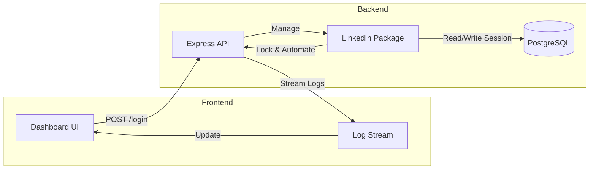

# LinkedIn Integration Reference Implementation

A production-ready reference architecture demonstrating how to consume the `@ubaidbinwaris/linkedin` service package in a modern Full-Stack application.

## 🎯 Purpose
This application serves as a **Test Bed** and **Reference Design** for integrating LinkedIn automation into your own SaaS or tooling. It demonstrates:

- **Database-Backed Sessions**: Storing encrypted session strings in PostgreSQL.
- **Real-Time UI**: Streaming automation logs via Server-Sent Events (SSE) to a frontend.
- **Status Management**: Visualizing `ACTIVE`, `BUSY`, and `ERROR` states.
- **Concurrency Handling**: Handling the package's `BUSY` errors gracefully.

## 🏗️ System Context



## 🛠️ Prerequisites

1.  **Node.js**: v14+
2.  **PostgreSQL**: Local or Cloud instance.
3.  **Browser**: Chrome/Edge installed (for Playwright).

## 🚀 Setup Guide

### 1. Database Setup
Create a database named `linkedin_test`. The application will automatically create the `linkedin_accounts` table on startup.

### 2. Configure Environment
Create a `.env` file in this directory:

```env
# Database Config
pg_username=postgres
pg_password=your_password
pg_database=linkedin_test
pg_host=localhost
pg_port=5432

# Encryption Key for Sessions (Must be 32 chars recommended)
SESSION_SECRET=my_super_secret_session_key_123!
```

### 3. Install Dependencies
```bash
npm install
```

### 4. Run Application
```bash
npm start
```
Server will start on `http://localhost:3000`.

## 🖥️ Using the Dashboard

1.  **Add Account**: Enter email and password. This saves to DB with status `IDLE`.
2.  **Login**: Click "Login".
    *   **Headless Start**: The backend attempts to login invisibly.
    *   **Mobile Check**: If "Open App" prompt appears, look at your phone! You have 2 minutes.
    *   **Fallback**: If you miss the mobile prompt, a **Visible Browser** will open on the server. You can then click/type manually to solve the captcha.
3.  **Live Logs**: Watch the black console panel for real-time feedback from the backend.

## 🐞 Troubleshooting

*   **"logger is not defined"**: Ensure you are using package version `v1.1.5` or higher.
*   **"Mobile verification timed out"**: Ensure you approve the login on your phone within 120 seconds.
*   **"CHECKPOINT_DETECTED_M"**: The visible browser fallback timed out (60-120s) without reaching the feed.
