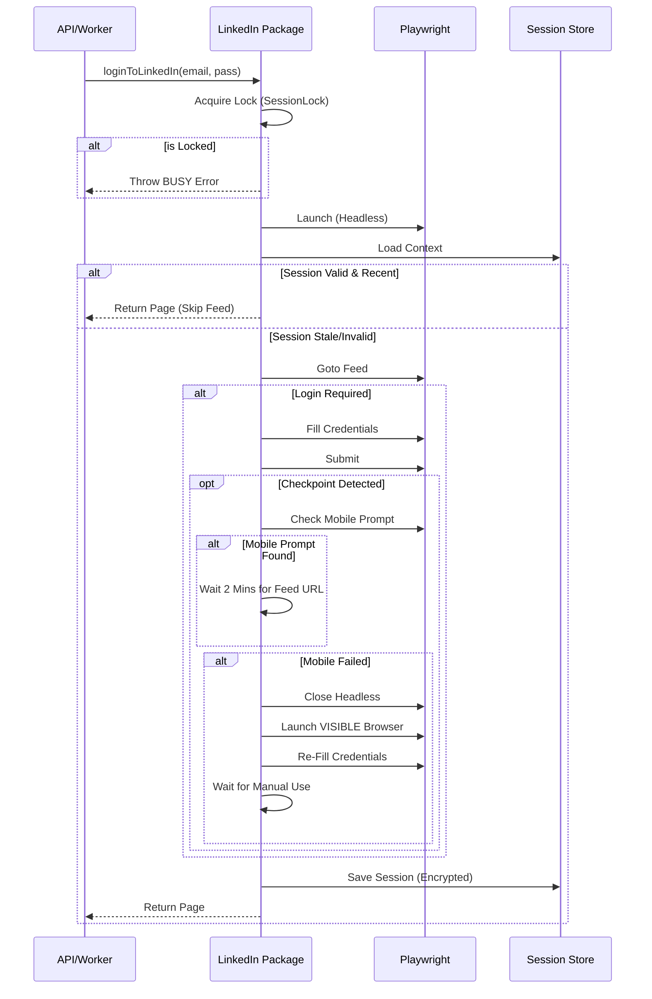

# @ubaidbinwaris/linkedin - Enterprise Automation Service


A professional, deterministic backend service library for managing multiple LinkedIn accounts with strict concurrency control, session isolation, and enterprise-grade security.

> **v1.1.7 Update**: Introduces "Smart Mobile Verification" with Visible Browser Fallback.

## 🚀 Key Features

*   **🛡️ Multi-User Concurrency**: Built-in `SessionLock` prevents race conditions. Impossible to double-login the same user.
*   **🔒 Enterprise Security**:
    *   Sessions stored as `SHA-256` hashed filenames (GDPR/Privacy friendly).
    *   Data encrypted with `AES-256-CBC` before storage.
*   **🧠 Smart Validation**:
    *   Caches validation checks for 10 minutes to minimize ban risk from excessive reloading.
    *   Automatically refreshes stale sessions.
*   **📱 Mobile & Fallback Support**:
    *   **Phase 1**: Detects "Open LinkedIn App" prompt and waits 2 minutes for user approval.
    *   **Phase 2**: If mobile fails, automatically launches a **Visible Browser** for manual intervention.

## 🏗️ Architecture

The library follows a strict **Fail-Fast** or **Resolution** flow. It does not use "stealth" plugins, relying instead on standard browser behavior and human intervention protocols.



## 📦 Installation

```bash
npm install @ubaidbinwaris/linkedin
```

## 💻 Usage

### 1. Basic Implementation
The simplest way to use the package. Locks and session management are handled automatically.

```javascript
const { loginToLinkedIn } = require('@ubaidbinwaris/linkedin');

(async () => {
    try {
        const { browser, page } = await loginToLinkedIn({
            headless: true // Will auto-switch to false if fallback needed
        }, {
            username: 'alice@example.com',
            password: 'secure_password'
        });

        console.log("✅ Logged in successfully!");
        
        // ... Perform scraping/automation tasks ...

        await browser.close();
        
    } catch (err) {
        if (err.message === 'CHECKPOINT_DETECTED') {
            console.error("❌ Critical: Account requires manual ID verification.");
        } else if (err.message.includes('BUSY')) {
            console.error("⚠️  User is already running a task.");
        } else {
            console.error("Error:", err.message);
        }
    }
})();
```

### 2. Custom Storage (Database Integration)
By default, sessions are saved to `./sessions`. Override this to use Redis, MongoDB, or PostgreSQL.

```javascript
const { setSessionStorage } = require('@ubaidbinwaris/linkedin');

setSessionStorage({
    read: async (email) => {
        // Return encrypted JSON string from your DB
        const result = await db.query('SELECT session_data FROM users WHERE email = $1', [email]);
        return result.rows[0]?.session_data; 
    },
    write: async (email, data) => {
        // Save encrypted JSON string to your DB
        await db.query('UPDATE users SET session_data = $1 WHERE email = $2', [data, email]);
    }
});
```

### 3. Custom Logger
Pipe internal logs to your own system (e.g., Winston, UI Stream).

```javascript
const { setLogger } = require('@ubaidbinwaris/linkedin');

setLogger({
    info: (msg) => console.log(`[LI-INFO] ${msg}`),
    warn: (msg) => console.warn(`[LI-WARN] ${msg}`),
    error: (msg) => console.error(`[LI-ERR] ${msg}`)
});
```

## 🚨 Error Reference

| Error Message | Meaning | Handling Action |
| :--- | :--- | :--- |
| `CHECKPOINT_DETECTED` | Security challenge (ID upload/Captcha) could not be resolved. | Notify admin. Manual Login required. |
| `CHECKPOINT_DETECTED_M` | Manual Fallback (Visible Browser) timed out. | User didn't interact in time. Retry. |
| `BUSY: ...` | A task is already running for this email. | Queue the request or reject it. |
| `LOGIN_FAILED` | Credentials accepted, but session could not be verified. | Check proxy/network. |

## License
ISC