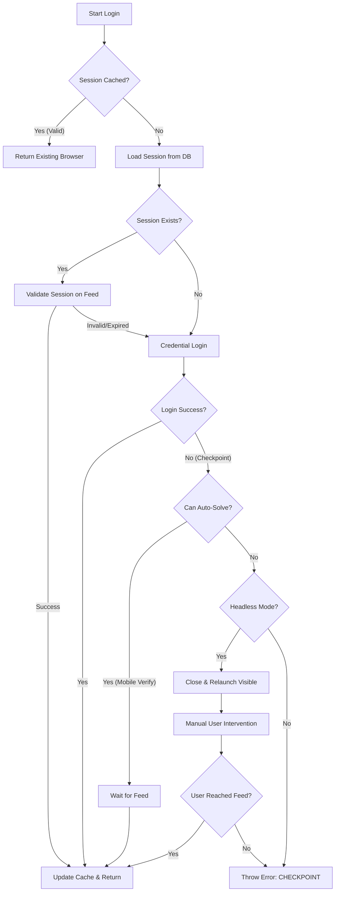

# Login & Authentication Workflow

This document explains the **step-by-step** logic used to authenticate with LinkedIn. The system is designed to be **deterministic**, **robust**, and safe.

## Logic Flowchart

## Detailed Steps

### 1. Initialization
The `loginToLinkedIn(options, credentials)` function is the entry point.
- It acquires a **SectionLock** to prevent multiple browsers from trying to login to the same account simultaneously.
- It launches a Playwright browser instance.

### 2. Session Loading
Before typing a password, we try to restore a previous session.
- **Source**: `server.js` adapter reads from Postgres.
- **Decryption**: `sessionManager.js` decrypts the data.
- **Result**: Browser context is restored with cookies.
- **Optimization**: If `context.needsValidation` is false (recently validated), we skip the feed check and return immediately.

### 3. Validation (The "Feed Check")
If the session is not fresh:
1.  Navigate to `https://www.linkedin.com/feed/`.
2.  Check for elements that exist only when logged in (e.g., global nav, identity module).
3.  **If I am on the feed**, the session is valid. Update timestamp and return.
4.  **If I am redirected to login**, the session is dead. Proceed to credential login.

### 4. Credential Login
If valid session is missing:
1.  Navigate to Login Page.
2.  Type Email (simulating human typing speed).
3.  Type Password.
4.  Click "Sign In".

### 5. Checkpoint & Challenge Handling
This is the most critical part. LinkedIn often asks for verification.

#### A. Mobile Verification (`handleMobileVerification`)
If the page asks for a phone number verification code (and we have logic to handle it, or if it's just a "verify it's you" prompt that we can click through):
- The system attempts to resolve it automatically.
- It waits for navigation to the Feed.

#### B. Manual Fallback
If an unknown challenge appears (CAPTCHA, new logic) and we are in **Headless Mode** (hidden browser):
1.  **Close Headless Browser**: We cannot solve it blindly.
2.  **Relaunch Visible Browser**: A new browser window opens on the server/desktop.
3.  **Fill Credentials**: The bot types the password again.
4.  **Wait for Human**: The bot pauses and waits (up to 2 minutes) for **YOU** to solve the puzzle or enter the SMS code.
5.  **Resume**: Once you reach the Feed, the bot takes control back, saves the new session, and continues.

### 6. Saving
Upon any successful access to the feed:
- `saveSession()` is triggered.
- The new cookies/state are encrypted and updated in the database.
- `session_status` in DB is updated to `'active'`.
